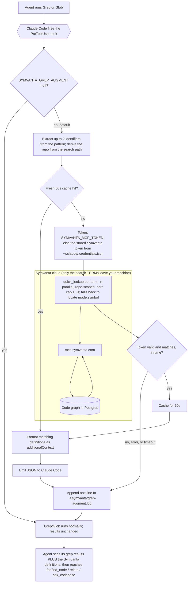

# Symvanta plugin for Claude Code

One-step setup for working in a [Symvanta](https://symvanta.com)-indexed
codebase. Installing this plugin:

- registers the Symvanta MCP server (default `https://mcp.symvanta.com/mcp`,
  configurable for on-prem / self-hosted, OAuth on first connection), so you do
  not edit `.mcp.json` by hand;
- injects standing context once at the start of every session so the agent
  reaches for the Symvanta code-graph tools instead of shell search;
- ships a `symvanta` skill with the full tool decision matrix and conventions;
- adds slash commands that wrap the common graph workflows.

## Commands

Each command routes to the right Symvanta MCP tool so you do not have to
remember tool names:

- `/symvanta:ask [question]`: answer a behavior question (how does X work, why
  does Y happen) via `ask_codebase`, with file citations.
- `/symvanta:blast [symbol]`: blast-radius safety check before editing a symbol.
- `/symvanta:trace [symbol]`: map a function's call chain, callers, and
  dependencies.
- `/symvanta:route [METHOD /path]`: find the handler for an HTTP route.
- `/symvanta:status`: connection and index health snapshot (project,
  repositories, freshness, edge counts).
- `/symvanta:architecture`: high-level module map (Louvain functional modules,
  PageRank hubs, cross-module coupling, and the repo-wide load-bearing functions)
  via `map` view:"architecture".
- `/symvanta:scope [symbol or change]`: pre-flight scope/impact estimate before
  you size a change (`estimate_scope`).
- `/symvanta:branch [name | clear]`: pin this session's reads to a tracked
  feature branch, or clear the pin (`ref`).
- `/symvanta:working-tree`: overlay your uncommitted edits so the graph reflects
  changes you have not pushed (`ref` op:"index_working_tree").
- `/symvanta:tests [symbol]`: find the tests that cover a symbol
  (`list_tests_for`).
- `/symvanta:recent [path]`: recently changed files and recent commits
  (`history`).

## Install

In Claude Code:

```
/plugin marketplace add https://symvanta.com/plugin/marketplace.json
/plugin install symvanta@symvanta
```

Sign in with OAuth when prompted on first connection. Your workspace's
Getting Started page in the Symvanta dashboard shows the exact marketplace URL
for your account.

## Configuration

The plugin points at Symvanta Cloud (`https://mcp.symvanta.com/mcp`) by default,
so Cloud users configure nothing. To point at a different Symvanta server, set
the **Symvanta MCP server URL** (`mcpUrl`) plugin option: accept or change it
when you enable the plugin, or later via the `/plugin` interface
(Symvanta -> configure). Leave it blank to fall back to the Cloud default.

Use the **full endpoint URL including the `/mcp` path, with no trailing slash**,
for example `https://mcp.your-company.com/mcp`. A bare host or a trailing slash
will fail to connect.

**Authentication.** Every Symvanta MCP server (Cloud, staging, or on-prem)
advertises its own OAuth endpoints, so Claude Code signs you in with OAuth on
first connection whatever URL `mcpUrl` points at, nothing to configure in the
plugin. On-prem supports the same OAuth flow: its gateway completes sign-in
against your Symvanta cloud / license and the server verifies the issued token.
Static API-key / bearer-token auth also exists for headless automation, but that
is configured on the server or in your own MCP settings, not in this plugin.

## Updating

```
/plugin update symvanta@symvanta
```

Then **restart Claude Code**. Claude Code reads the plugin (including
`hooks/hooks.json`) when it loads, not continuously, so a running session keeps
the previously loaded version until you restart. Until then a `/plugin update` is
downloaded but not active.

## What runs on your machine

The plugin executes small, readable Node hook scripts locally:

- [`session-start.js`](hooks/session-start.js): prints standing context once at
  the start of a session. Sends nothing anywhere.
- The **augment hook family** (on by default): five hooks sharing one core
  ([`lib.js`](hooks/lib.js)). Each can only **add** context, never block:
  every error, timeout, or missing token is a clean pass-through, and the
  intercepted tool always runs untouched.
  - [`grep-augment.js`](hooks/grep-augment.js): on `Grep`/`Glob`, looks up
    matching indexed symbol **definitions** (scoped to the repo you are
    searching, up to two identifiers from the pattern in parallel, 60s cache)
    and adds them alongside the raw search results.
  - [`edit-augment.js`](hooks/edit-augment.js): on `Edit`/`Write` of a code
    file, injects the edited symbol's **blast radius** (upstream symbol count,
    files, layers, cross-repo edges, risk tier) before the change lands; a
    Write over an existing file lists the definitions the overwrite replaces.
    New files and non-code files stay silent.
  - [`read-augment.js`](hooks/read-augment.js): on the **first** `Read` of a
    code file per session, injects the file's symbol skeleton (names, kinds,
    line bounds) plus any architecture decision records anchored to it.
    Repeat reads exit instantly.
  - [`grep-rescue.js`](hooks/grep-rescue.js): after a `Grep` that found
    **nothing**, suggests graph candidates (auto text/semantic search) so a
    dead end becomes a lead; a grep with results exits right after the stdin
    parse, no reads, no network.
  - [`prompt-augment.js`](hooks/prompt-augment.js): identifier-shaped tokens
    in your message (backticked spans, snake_case, camelCase) resolve to
    indexed definitions at turn start. Plain prose never qualifies, so
    conversational prompts stay silent.

### What the augmenters read, send, and write, exactly

To call the graph they need your Symvanta MCP token. They reuse the one Claude
Code already stored when you connected, so there is no setup. The read is
deliberately narrow and each script is short enough to audit in minutes:

- They read **only** `mcpOAuth[<the Symvanta entry>].accessToken` from
  `~/.claude/.credentials.json`. Never your Anthropic token (`claudeAiOauth`)
  or any non-Symvanta server's token.
- That token is sent **only** to the Symvanta MCP server, the same place it
  was issued for.
- What leaves the machine per lookup: extracted identifier **terms**, matched
  **symbol names**, and repo-relative **file paths**. Never file contents, and
  never your message text (the prompt hook sends at most two identifier
  tokens, not the prompt).
- They write local files under `~/.symvanta/`, never uploaded anywhere:
  `grep-cache/` (the 60s result cache, one small file per key),
  `repo-cache.json` (path-to-repo memo), `read-seen/` (per-session first-read
  markers), and `grep-augment.log` (one JSONL line per run: hook, terms, repo,
  match count, latency, cache hit). The log exists so `/symvanta:status` can
  show what the hooks are doing; delete any of these files anytime.

Switches (restart Claude Code after changing):

```
# Supply your own token instead (dashboard -> Settings -> MCP connection ->
# regenerate gives a Passport mcp:read token); the credentials file is then
# never read:
export SYMVANTA_MCP_TOKEN="<token>"

# Turn the whole family off (no reads, no network on any tool call):
export SYMVANTA_AUGMENT=off        # the legacy SYMVANTA_GREP_AUGMENT=off also works

# Or turn off individual hooks:
export SYMVANTA_EDIT_AUGMENT=off   # Edit/Write blast radius
export SYMVANTA_READ_AUGMENT=off   # first-read skeleton + ADRs
export SYMVANTA_GREP_RESCUE=off    # empty-grep suggestions
export SYMVANTA_PROMPT_AUGMENT=off # prompt term lookup
```

You can also delete any hook's block from
[`hooks/hooks.json`](hooks/hooks.json) to remove it entirely.

`Bash` and every tool without a hook above run untouched. All code navigation
happens through the Symvanta MCP server over HTTPS, gated by OAuth. No
telemetry, no background processes.

### How the Grep/Glob augmenter works

Every gate fails safe to the same pass-through, and both pass-through and
success land on "Grep runs normally": the hook can only add context, never
block or delay the search to failure. `SYMVANTA_GREP_AUGMENT=off`
short-circuits before anything is read or sent.



## Uninstall

```
/plugin uninstall symvanta@symvanta
/plugin marketplace remove symvanta
```

## Layout

```
.claude-plugin/plugin.json   manifest + MCP server registration
hooks/hooks.json             SessionStart + augment family wiring (PreToolUse, PostToolUse, UserPromptSubmit)
hooks/session-start.js       standing-context injector
hooks/lib.js                 shared augment core (auth, transport, cache, log)
hooks/grep-augment.js        Grep/Glob definition augmenter
hooks/edit-augment.js        Edit/Write blast-radius augmenter
hooks/read-augment.js        first-read file skeleton + ADR augmenter
hooks/grep-rescue.js         empty-grep graph suggestions (PostToolUse)
hooks/prompt-augment.js      prompt identifier lookup (UserPromptSubmit)
hooks/augment-stats.js       local activity summary for /symvanta:status
commands/                    slash commands (ask, blast, trace, route, status, architecture, scope, branch, working-tree, tests, recent)
skills/symvanta/SKILL.md     tool decision matrix and conventions
scripts/                     sync-skill.mjs (SKILL from source) + check-tool-prefixes.mjs (CI guard)
```

## License

MIT
