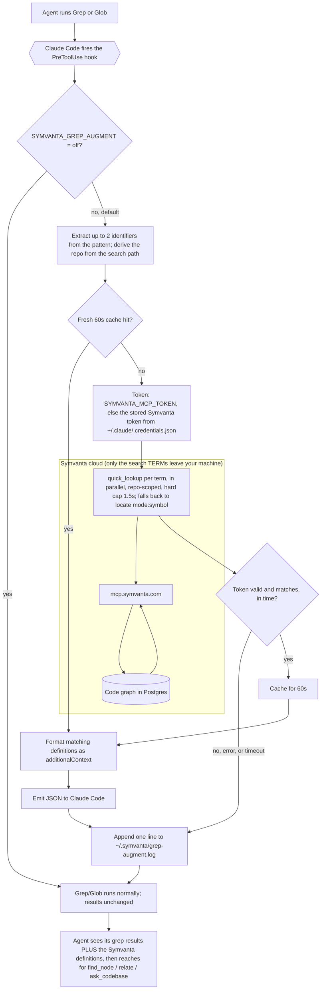

# Symvanta plugin for Claude Code

One-step setup for working in a [Symvanta](https://symvanta.com)-indexed
codebase. Installing this plugin:

- registers the Symvanta MCP server (`https://mcp.symvanta.com/mcp`, OAuth on
  first connection), so you do not edit `.mcp.json` by hand;
- injects standing context once at the start of every session so the agent
  reaches for the Symvanta code-graph tools instead of shell search;
- ships a `symvanta` skill with the full tool decision matrix and conventions;
- adds slash commands that wrap the common graph workflows.

## Commands

Each command routes to the right Symvanta MCP tool so you do not have to
remember tool names:

- `/symvanta:ask [question]`: answer a behavior question (how does X work, why
  does Y happen) via `ask_codebase`, with file citations.
- `/symvanta:blast [symbol]`: blast-radius safety check before editing a symbol.
- `/symvanta:trace [symbol]`: map a function's call chain, callers, and
  dependencies.
- `/symvanta:route [METHOD /path]`: find the handler for an HTTP route.
- `/symvanta:status`: connection and index health snapshot (project,
  repositories, freshness, edge counts).

## Install

In Claude Code:

```
/plugin marketplace add https://symvanta.com/plugin/marketplace.json
/plugin install symvanta@symvanta
```

Sign in with OAuth when prompted on first connection. Your workspace's
Getting Started page in the Symvanta dashboard shows the exact marketplace URL
for your account.

## Updating

```
/plugin update symvanta@symvanta
```

Then **restart Claude Code**. Claude Code reads the plugin (including
`hooks/hooks.json`) when it loads, not continuously, so a running session keeps
the previously loaded version until you restart. Until then a `/plugin update` is
downloaded but not active.

## What runs on your machine

The plugin executes two small, readable Node hook scripts locally:

- [`session-start.js`](hooks/session-start.js): prints standing context once at
  the start of a session. Sends nothing anywhere.
- [`grep-augment.js`](hooks/grep-augment.js): **on by default**, runs **only**
  on `Grep`/`Glob`. It asks the Symvanta graph which indexed symbol
  **definitions** match your search term (scoped to the repo you are searching,
  derived from the search path's git remote) and adds them to the agent's
  context, so the agent learns to reach for the graph tools. Up to two distinct
  identifiers from the pattern are looked up in parallel, and results are cached
  for 60s so repeated searches are instant. It can only **add** context, never
  block: every error, timeout, or missing token is a clean pass-through, and the
  Grep itself always runs untouched. To run the lookup it sends only the
  **search term** (not your file contents) to the Symvanta MCP server.

### What the augmenter reads and writes, exactly

To call the graph it needs your Symvanta MCP token. It reuses the one Claude
Code already stored when you connected, so there is no setup. The read is
deliberately narrow and the script is short enough to audit in a minute:

- It reads **only** `mcpOAuth[<the Symvanta entry>].accessToken` from
  `~/.claude/.credentials.json`. It never reads your Anthropic token
  (`claudeAiOauth`) or any non-Symvanta server's token.
- That token is sent **only** to the Symvanta MCP server, the same place it was
  issued for.
- It writes two local files under `~/.symvanta/`, never uploaded anywhere:
  `grep-cache.json` (the 60s result cache) and `grep-augment.log` (one JSONL
  line per run: term, repo, match count, latency, cache hit). The log records
  your search terms locally so you can see how often the augmenter helps; delete
  the file anytime, or set `SYMVANTA_GREP_AUGMENT=off` to stop all of it.

If you would rather it not read the credentials file, you have two switches:

```
# Supply your own token instead (dashboard -> Settings -> MCP connection ->
# regenerate gives a Passport mcp:read token); the credentials file is then
# never read:
export SYMVANTA_MCP_TOKEN="<token>"

# Or turn the augmenter off entirely (no read, no network on tool calls):
export SYMVANTA_GREP_AUGMENT=off
```

You can also delete the `PreToolUse` block from
[`hooks/hooks.json`](hooks/hooks.json) to remove it. Restart Claude Code after
any of these.

`Bash`, `Edit`, and every other tool run untouched. All code navigation happens
through the Symvanta MCP server over HTTPS, gated by OAuth. No telemetry, no
background processes.

### How the Grep/Glob augmenter works

Every gate fails safe to the same pass-through, and both pass-through and
success land on "Grep runs normally": the hook can only add context, never
block or delay the search to failure. `SYMVANTA_GREP_AUGMENT=off`
short-circuits before anything is read or sent.



## Uninstall

```
/plugin uninstall symvanta@symvanta
/plugin marketplace remove symvanta
```

## Layout

```
.claude-plugin/plugin.json   manifest + MCP server registration
hooks/hooks.json             SessionStart + PreToolUse(Grep|Glob) wiring
hooks/session-start.js       standing-context injector
hooks/grep-augment.js        non-blocking Grep/Glob augmenter
commands/                    slash commands (ask, blast, trace, route, status)
skills/symvanta/SKILL.md     tool decision matrix and conventions
```

## License

MIT
